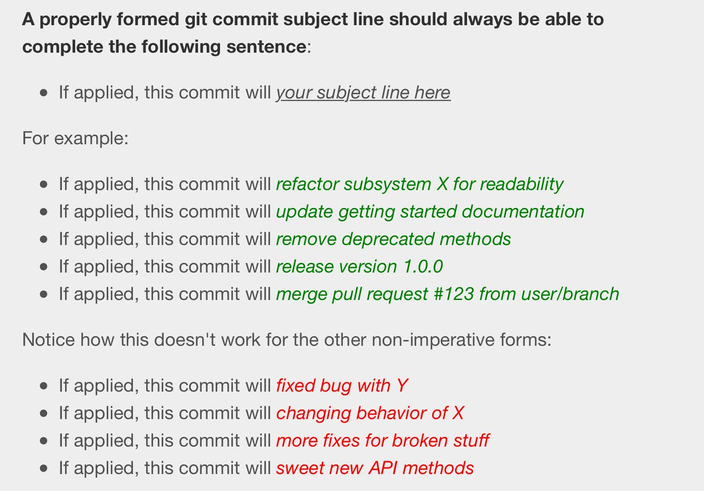

# 前端新手训练营

> 首先，恭喜你经过层层选拔，顺利加入 CI 前端团队 ！

通过训练营你能给够了解 CI 前端开发的特点、规范、技术栈，并且找到公司的内部资源，学习资料，文档等帮助。

## CI 前端的特点

- 严格分离
 - 前后端完全分离的，各自独立部署
- 组件化
 - 基于 `React` 的模块化开发
 - 使用 `NPM` 管理依赖
- 自动化
 - 提倡 `DevOps` 文化，提高生产率
- 支持现代浏览器 

> 在这里我们只支持现代浏览器，我们的目标是打造世界上最棒的 SaaS 产品前端体验。

|     IE       |    Chrome   |   Firefox    |   Safari   |
|--------------|-------------|--------------|------------|
|     11       |    N - 1    |     N - 1    |    N - 1   |

## CI 前端宣言

> 从你提第一个 Pull Request 开始就代表你认同此宣言

<pre><h1>我的每一个提交都是有意义的
我会响应变化而不是循规蹈矩
我会对每一个引入的模块负责
我会遵守团队的前端代码规范
我会和团队里的人很好地互动
</h1></pre>

## 规范

### 分支管理规范

- [分支管理](http://www.ruanyifeng.com/blog/2012/07/git.html)

概括成几句话

- 日常开发在 `dev` (Develop), 在这个分支上多多使用 `git rebase`
- 新功能如果包含多个提交，提交到 `feature/CI-xxx` ，合并到 `dev` 后删除
- 小版本的维护在 `release/x.x.x` 上
- `master` 只能提交紧急的 `bug` 修复，并打上 `vx.x.x-hotfix-x` 的 `tag`
- 新功能只有合并到 `dev` 分支, QA 才有义务去测试

### 代码提交规范

- **必须** 写提交说明
- 提交说明以提交的类型开头，FIX（修补），REFACTOR（重构），DOCS（文档）

关于怎么写提交信息，可以参考这篇文章 [英文](http://chris.beams.io/posts/git-commit/)
如果觉得文章太长，只需要记住下面这张图片

via [twitter](https://twitter.com/mislav/status/746289239457996800)

### 代码风格规范

我们使用 ESLint 检查代码风格，并借鉴了

[eslint-config-airbnb](https://www.npmjs.com/package/eslint-config-airbnb)

你的每一个提交都会经过持续集成的检查，如果有不符合规范的地方会收到告警邮件。
每一个研发人员都有义务修复不符合规范的提交。

### 依赖管理规范

我们使用 `package.json` 管理项目的依赖，任何人都可以更新它。

但是在引入新模块的时候需要综合参考这几点：

- 在 Github 上 Star 数量，非常冷门的模块不予采用
- 有没有活跃的 Maintainer ，一年以上没有代码更新的模块不予采用
- Issues 是不是能够很快的解决，响应速度越快用起来越安心
- 和 CI 项目里的其它模块是不是有冲突

在此基础上，我们推荐**勤更新模块**，这样可以保证新手在查阅最新文档时不会困惑。

对于 `自定义模块`，如有必要我们推荐把源码放到 Github 上，并发布到 NPM 的官方源而不是公司的私有 NPM 仓库。

## 任务分配

各种 Issue 就是 CI 前端的任务（面向 Issue 开发），`JIRA`，`Github` 都是我们管理 Issue 的好地方。

CI 前端倾向于以主动领取为主，分配为辅的策略。

对新手来说一般会经历这样的一个过程：

- 第一个阶段的 Issue 会很简单，一般是和样式有关或者依葫芦画瓢就能搞定的问题

> 这个阶段的主要目的是了解环境搭建，基础框架，目录结构等

- 第二个阶段的 Issue 可能是和项目相关的插件，工具的开发有关
 
> 这个阶段的设置主要是为了让新手了解 CI 前端作为一个整体在做的项目，涉及的工具，以及上线的流程

- 第三个阶段的 Issue 会要求实现一个完善的功能

> 这个阶段要求开发人员就能够从总体上把握和运用设计思维去完成一个功能，并考虑到用户实际使用的体验

## 公司的内部资源

- OneAPM 公共组件
- Gitlab
- Jenkins

[更多](http://wiki.oneapm.me/pages/viewpage.action?pageId=7575054)

## 学习资料

> 如果你对 Git, ES6, React 还不是特别熟悉，可以参考下面的学习资料

- [Git](http://rogerdudler.github.io/git-guide/index.zh.html)
- [ES6 入门](http://es6.ruanyifeng.com/)
- [React](https://facebook.github.io/react/docs/getting-started.html)
- [12-Factor](https://12factor.net/zh_cn/)

## 手册和文档

- [浏览器兼容性](http://caniuse.com/)
- [React Bootstrap](http://react-bootstrap.github.io/)
- [React Router](https://github.com/reactjs/react-router)
- [Redux](https://github.com/reactjs/redux/tree/master/docs)
- [Webpack](http://webpack.github.io/docs/)

## 内部分享

- [OneAPM 前端分享会](http://wiki.oneapm.me/pages/viewpage.action?pageId=15151040)

## 开发工具

- [CI 前端调试插件](https://chrome.google.com/webstore/detail/cloudinsight-dev/bglckjbhffgndhlgbkbhhblpnhfapjpl)
